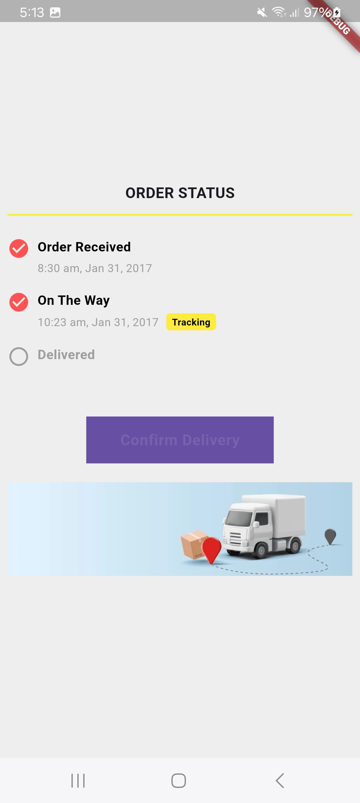
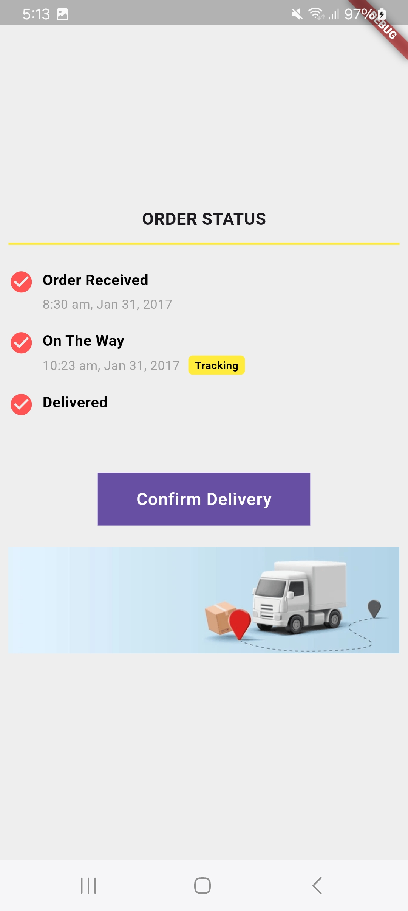

# E-commece order status with Flutter dart
  
  ## Interactive Order Status tracking 


## Features
* **Checking order's from user's app:**  
* **CDynamic Delivery Confirmation:** 
* **CCustomizable UI Elements:** 

## File stracture

    
    ├── lib
        ├── main.dart                  
        ├── order_status_card.dart   
        ├── order_status_step.dart   
 
  - main.dart: Contains the OrderStatusApp root widget and main function to run the app.
  - order_status_card.dart: Defines the main structure of the order tracking card, including progress steps and the confirm delivery button.
  - order_status_step.dart: Manages individual step details, including title, timestamp, and status indicators.
 
<p float="left">
 
 
</p>

 

## Run Locally

Clone the project

```bash
  git clone https://github.com/abdulawalarif/order_status.git
```

Go to the project directory

```bash
  cd order_status
```

Install dependencies

```bash
  flutter pub get
```

Connect a physical device or start a virtual device on your machine

```bash
  flutter run
```

## Customization Tips
- Update Order States: Add or remove order stages by modifying the OrderStatusCard widget, creating custom stages as needed.
- Asset Customization: Replace the example image in assets/order.png to fit your own design.
- Button Styling: Customize the 'Confirm Delivery' button's appearance and functionality in order_status_card.dart to better match your requirements.

## Reporting Bugs or Requesting Features?

If you found an issue or would like to submit an improvement to this project,
please submit an issue using the issues tab above. If you would like to submit a PR with a fix, reference the issue you created!

 
## Author

- [@abdulawalarif](https://github.com/abdulawalarif) 
  
## License

[MIT](https://choosealicense.com/licenses/mit/)
